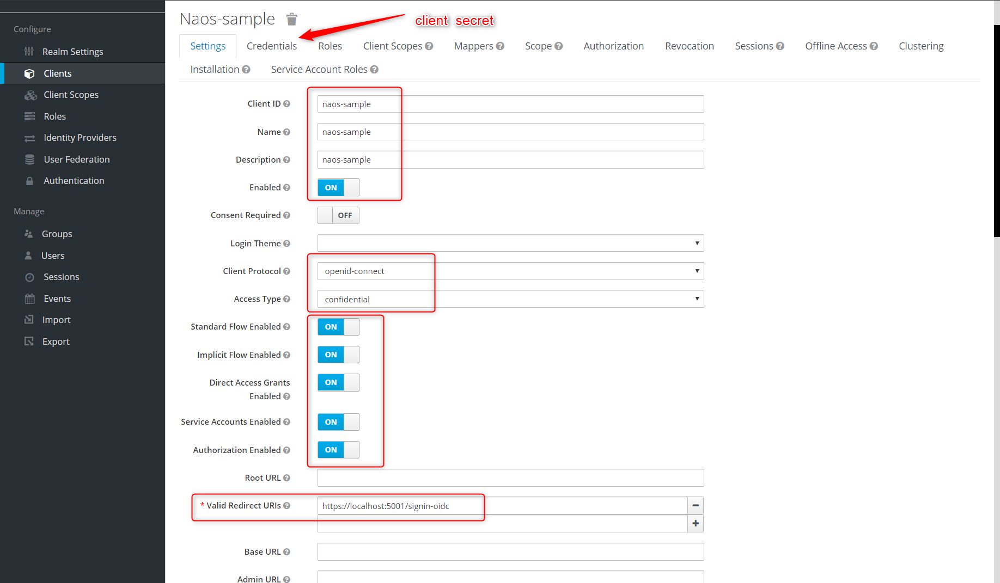

keycloak client setup:


webapi appsettings:
```
 "Oidc": {
    "ClientId": "naos-sample",
    "ClientSecret": "8c87b1b0-9b2b-4ac6-bc37-88f093c04d13",
    "Authority": "http://localhost:8080/auth/realms/master"
  }
```

todos:
- +dockercompose (keycloak/sql/webapi)
- simple html page for login https://github.com/GluuFederation/openid-implicit-client
- autosetup keycloak client? with api request? 
  - https://www.keycloak.org/docs-api/5.0/rest-api/index.html#_clients_resource
  - https://stackoverflow.com/questions/53283281/how-to-activate-the-rest-api-of-keycloak
 

links:
- https://developer.okta.com/blog/2019/11/15/aspnet-core-3-mvc-secure-authentication